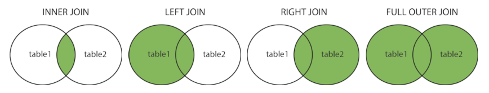

# SQL 첫걸음

- [My SQL 설치하기](setup.md)
- [1장 데이터 베이스 구축](chapter01/README.md)
- [2장 테이블에서 데이터 검색](chapter02/README.md)
- [3장 정렬과 연산](chapter03/README.md)
- [4장 데이터 추가, 삭제, 갱신](chapter04/README.md)
- [5장 집계와 서브쿼리](chapter05/README.md)
- [6장 데이터베이스 객체 작성과 삭제](chapter06/README.md)
- [7장 복수의 테이블 다루기](chapter07/README.md)

## JOIN

- INNER JOIN : 두 테이블이 공통적으로 가지고 있는 레코드를 반환한다.
- LEFT JOIN : 두 테이블이 공통적으로 가지고 있는 레코드와 왼쪽 테이블의 모든 레코드를 반환한다.
- RIGHT JOIN : 두 테이블이 공통적으로 가지고 있는 레코드와 오른쪽 테이블의 모든 레코드를 반환한다.
- FULL OUTER JOIN : 두 테이블이 공통적으로 가지고 있는 레코드와 왼쪽 오른쪽 테이블의 레코드를 반환한다.

## SQL문 처리순서
1. FROM
2. WHERE
3. GROUP BY
4. HAVING
5. SELECT
6. ORDER BY

- 원하는 테이블을 찾아가(FROM)   
- 조건을 이용해 원하는 데이터를 검색한 후(WHERE)  
- 그룹으로 묶은 뒤(GROUP BY)  
- 그룹화된 데이터를 조건을 이용해 검색한 후(HAVING)  
- 원하는 데이터를 선택해(SELECT)  
- 정렬해서 내보낸다.(ORDER BY)

## DDL, DML, DCL 이란

### DDL

> 데이터 베이스 스키마를 정의하기 하거나 조작하기 위한 명령어

| 명령어   | 설명                                         |
| -------- | -------------------------------------------- |
| CREATE   | 데이터 베이스, 테이블을 생성하기 위한 명령어 |
| ALTER    | 테이블을 수정하기 위한 명령어                |
| DROP     | 데이터베이스, 테이블을 삭제하기 위한 명령어  |
| RENAME   |
| TRUNCATE | 데이터베이스를 초기화 시키기 위한 명령어     |

### DML

> 데이터 베이스에 저장된 데이터를 조회, 수정, 삽입, 삭제하기 위한 언어

| 명령어 | 설명                           |
| ------ | ------------------------------ |
| SELECT | 데이터를 조회 하기 위한 명령어 |
| INSERT | 데이터를 삽입하기 위한 명령어  |
| UPDATE | 데이터를 수정하기 위한 명령어  |
| DELETE | 데이터를 삭제하기 위한 명령어  |

### DCL

> 데이터 베이스에 접근하거나 객체에 권한을 주는 역할을 하는 언어

| 명령어   | 설명                                                                         |
| -------- | ---------------------------------------------------------------------------- |
| GRANT    | 데이터 베이스 사용자에게 특정 작업에 대한 권한을 주기 위한 명령어            |
| REVOKE   | 데이터 베이스 사용자에게 특정 작업에 대한 권한을 회수, 박탈 하기 위한 명령어 |
| COMMIT   | 트랜잭션 작업 결과를 반영하기 위한 명령어                                    |
| ROLLBACK | 트랜잭션 작업을 취소 및 원래대로 복구하기 위한 명령어                        |

## 트랜잭션과 ACID

- 원자성(Atomicity)
  - 트랜잭션이 부분적으로 실행되거나 중단되지 않음을 보장한다.
  - 즉, 분해가 불가능한 최소 단위인 하나의 원자처럼 동작한다는 의미
  - All or nothing의 개념으로 작업의 일부분만을 실행시키지 않는다.
- 일관성(Consistency)
  - 트랜잭션이 성공적으로 수행되면 일관적인 DB상태를 유지함을 보장한다.
  - 여기서 말하는 일관성이란, 작업을 수행한 후 자료형이 변하지 않음을 보장한다는 것이다.
- 격리성(Isolation)
  - 트랜잭션이 수행되고 있을 때 다른 트랜잭션의 작업이 끼어들지 않음을 보장한다.
  - 트랜잭션끼리는 서로 간섭할 수 없다.
- 지속성(Durability)
  - 성공적으로 수행한 트랜잭션은 영원히 지속됨을 보장한다.

## 원자성 보장
> 트랜잭션에 의한 변경 내용을 유지하면서, 이전에 commit된 시점의 데이터를 임시영역에 따로 저장함으로써 원자성을 보장한다. 현재 수행하고 있는 트랜잭션에 오류가 나면 현재 내역을 날려버리고 임시 영역에 저장했던 상태로 rollback을 한다.

- 이전 데이터들이 저장된 영역을 `롤백 세그먼트`라고 부른다.
- 현재 수행중인 트랜잭션에 의해 새롭게 변경되는 내역을 `데이터베이스 테이블`이라 부른다.
- 트랜잭션의 원자성은 `롤백 세그먼트`에 의해 보장이 된다.

## 일관성 보장

## 격리성 보장

- lock & excute unlock을 통해 고립성을 보장한다.
- 데이터를 쓸 때는 문을 잠궈서 다른 트랜잭션이 접근하지 않도록 고립성을 보장하고, 수행을 마치면 unlock을 통해 데이터를 다른 트랜잭션이 접근할 수 있도록 허용하는 방식이다.
- `shared lock` : 트랜잭션에서 데이터를 읽을 때 다른 트랜잭션들이 읽을 수는 있도록 허용하는 lock
- `exelusive lock` : 한 트랜잭션에서 데이터를 수정하고 있을 경우 다른 트랜잭션들이 접근을 못하도록하는 lock

## 지속성 보장

## 프로그래머스 sql문제

### select 문
- 모든 레코드 조회하기 https://programmers.co.kr/learn/courses/30/lessons/59034
- 역순 정렬하기 https://programmers.co.kr/learn/courses/30/lessons/59035
- 아픈 동물 찾기 https://programmers.co.kr/learn/courses/30/lessons/59036
- 어린 동물 찾기 https://programmers.co.kr/learn/courses/30/lessons/59037
- 동물의 아이디와 이름 https://programmers.co.kr/learn/courses/30/lessons/59403
- 여러 기준으로 정렬하기 https://programmers.co.kr/learn/courses/30/lessons/59404
- 상위 n개 레코드 https://programmers.co.kr/learn/courses/30/lessons/59405

### 집계함수 (SUM, MAX, MIN)
- 최댓 값 구하기 https://programmers.co.kr/learn/courses/30/parts/17043
- 최솟 값 구하 https://programmers.co.kr/learn/courses/30/lessons/59038
- 동물 수 구하기 https://programmers.co.kr/learn/courses/30/lessons/59406
- 중복 제거하기 https://programmers.co.kr/learn/courses/30/lessons/59408

### 그룹화 (GROUP BY)
- 고양이와 개는 몇마리 있을까 https://programmers.co.kr/learn/courses/30/lessons/59040
- 동명 동물 수 찾기 https://programmers.co.kr/learn/courses/30/lessons/59041
- 입양 시각 구하기 https://programmers.co.kr/learn/courses/30/lessons/59412
- 입양 시각 구하기2 https://programmers.co.kr/learn/courses/30/lessons/59413

### NULL 처리하기
- 이름이 없는 동물의 아이디 https://programmers.co.kr/learn/courses/30/lessons/59039
- 이름이 있는 동물의 아이디 https://programmers.co.kr/learn/courses/30/lessons/59407
- NULL 처리하기 https://programmers.co.kr/learn/courses/30/lessons/59410

### JOIN문
- 없어진 기록 찾기 https://programmers.co.kr/learn/courses/30/lessons/59042
- 있었는데요 없었습니다. https://programmers.co.kr/learn/courses/30/lessons/59043
- 오랜 기간 보호한 동물(1) https://programmers.co.kr/learn/courses/30/lessons/59044
- 보호소에서 중성화한 동물 https://programmers.co.kr/learn/courses/30/lessons/59045

### String, Date
- 루시와 엘라 찾기 https://programmers.co.kr/learn/courses/30/lessons/59046
- 이름에 el이 들어가는 동물 찾기 https://programmers.co.kr/learn/courses/30/parts/17047
- 중성화 여부 파악하기 https://programmers.co.kr/learn/courses/30/lessons/59409
- 오랜기간 보호한 동물(2) https://programmers.co.kr/learn/courses/30/lessons/59411
- DATETIME에서 DATE로 형 변환 https://programmers.co.kr/learn/courses/30/lessons/59414

